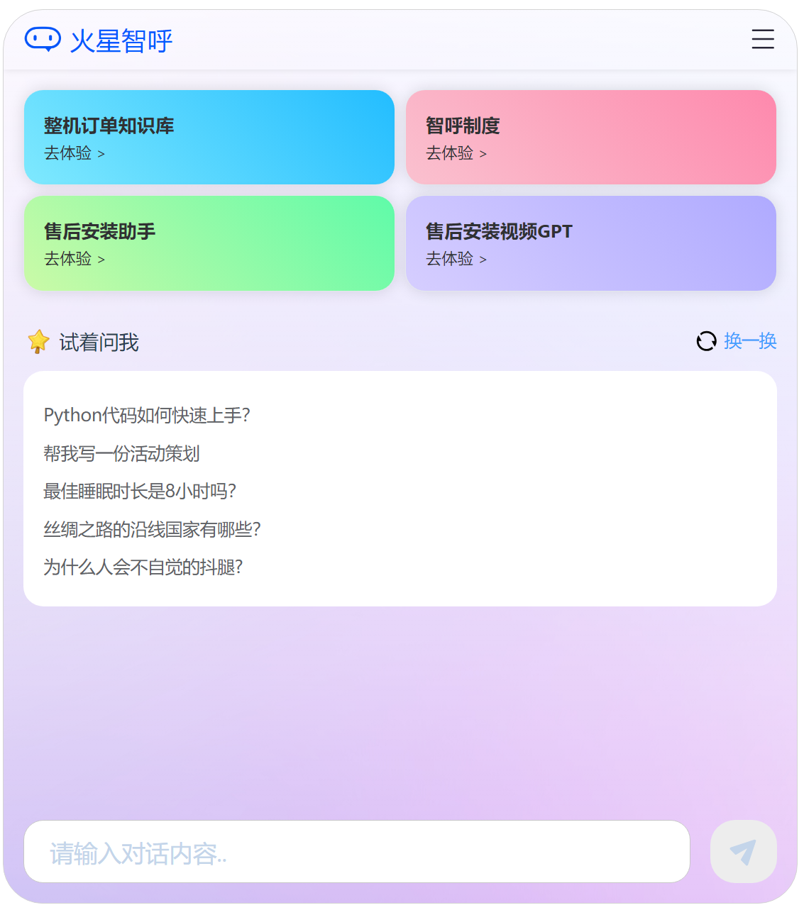
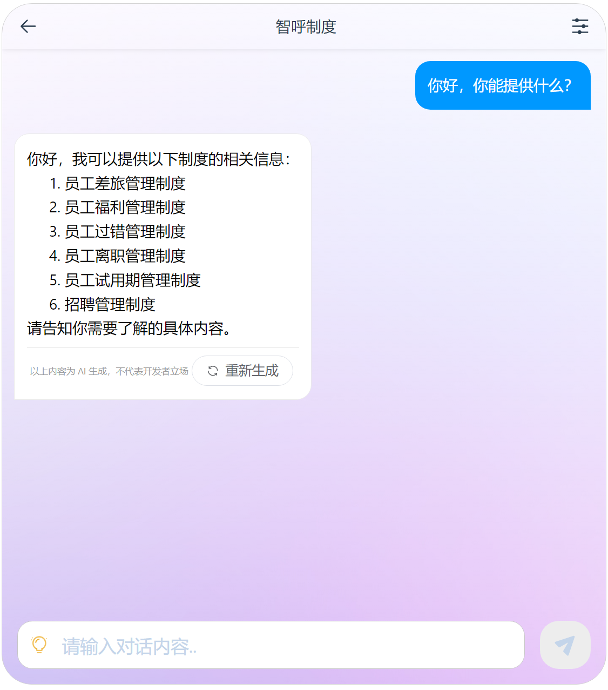

# Chat2LLM-H5
> - Chat2LLM是和大语言模型(LLM)对话的项目，利用这个项目，可以落地一些AI应用场景, 如知识库，智能客服。
> - 当前h5对接的是一个python后端，地址[chat2llm-server](http://192.168.101.64/chat2llm/chat2llm-server)，也是唯一的后端。
> - 本项目已部署——企微里搜索“火星智呼”。

这是项目的h5客户端。

## 功能
- [x] 基础的对话
- [ ] 语音输入
- [x] 知识库版块
- [x] 历史记录留存
- [x] 认证机制
## 技术栈
- node: 18.16.0
- npm: 9.5.1
- vite: ^4.4.11
- vue: ^3.3.4
- typescript: ~5.2.0

## 截图

